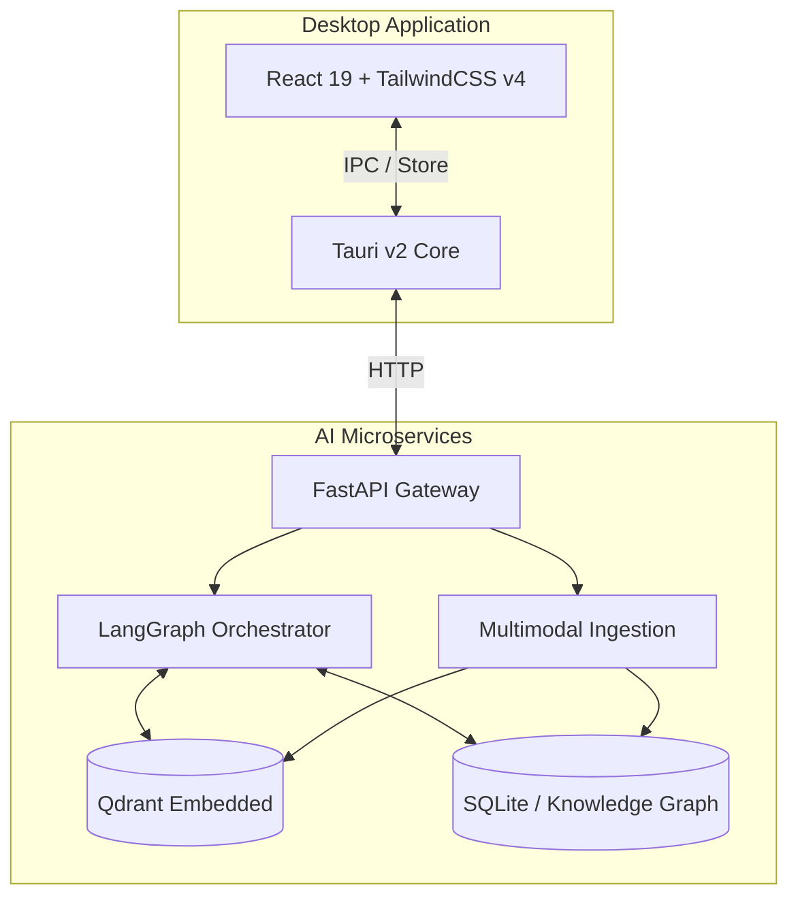

<div align="center">

# 🧠 Nodus

**The Local-First Private AI Memory Infrastructure**

[](https://tauri.app)
[](https://react.dev)
[](https://python.org)
[](https://fastapi.tiangolo.com/)
[](https://opensource.org/licenses/MIT)

A production-grade, cross-platform, privacy-first AI personal knowledge operating system. Nodus runs locally on your device, leveraging local LLMs, embedded vector databases, and an autonomous AI orchestration layer to map, remember, and navigate your digital life.

[Architecture](#architecture) • [Features](#features) • [Getting Started](#getting-started) • [Documentation](#documentation)

</div>

---

## ✨ Core Capabilities

- **Local AI Inference**: Run LLMs completely offline via Ollama/llama.cpp with GPU acceleration.
- **Autonomous Agents**: Powered by `LangGraph` and `LangChain`, featuring 7 specialized agents (Research, Writing, Coding, etc.) equipped with multi-step reasoning and tool chaining.
- **Semantic Memory**: Persistent conversational memory, temporal awareness, and persistent entity extraction.
- **Multimodal Ingestion**: Drag-and-drop indexing for PDFs, DOCX, Images, and Audio using `Whisper`, `PaddleOCR/Tesseract`, and `PyMuPDF`.
- **Knowledge Graph**: Automatic extraction of entities and relationships to build a holistic map of your data.
- **Zero-Knowledge Architecture**: Total privacy. No cloud dependencies required.

## 🏗 Architecture

Nodus is split into two highly optimized subsystems communicating via local IPC and HTTP:



## 🛠 Tech Stack

- **Desktop UI**: Tauri v2, Rust, React 19, TypeScript 5, TailwindCSS v4, Zustand, Lucide Icons.
- **AI Services**: Python 3.12, FastAPI, LangGraph, LangChain (`langchain-ollama`).
- **Data Stores**: SQLite, Qdrant (embedded).
- **Parsers**: Whisper (Speech), PyTesseract/PyMuPDF (Documents & OCR).
- **Environment**: `uv` (Python dependency management).

## 🚀 Getting Started

### Prerequisites

Ensure you have the following installed on your host machine:
- [Node.js](https://nodejs.org/) (v20+)
- [Python](https://python.org/) (v3.12+)
- [uv](https://github.com/astral-sh/uv) (Extremely fast Python package installer)
- [Ollama](https://ollama.ai/) (Running locally on default port `11434`)
- [Rust & MSVC Build Tools](https://visualstudio.microsoft.com/visual-cpp-build-tools/) (Required for compiling the native Tauri desktop app on Windows)

### 1. Start the Python AI Backend

The backend is built as a modular FastAPI monolith using `uv` for lightning-fast virtual environment management.

```bash
# Navigate to the services directory
cd ai-services

# Install dependencies and sync virtual environment
uv sync

# Activate the virtual environment
# Windows:
.\.venv\Scripts\Activate.ps1
# macOS/Linux:
# source .venv/bin/activate

# Run the backend server
uvicorn gateway.main:app --reload --host 127.0.0.1 --port 8000
```
*The API documentation will be available at [http://127.0.0.1:8000/docs](http://127.0.0.1:8000/docs).*

### 2. Start the Desktop Client

You can run the frontend either as a native desktop application (via Tauri) or as a web app in your browser.

```bash
# Navigate to the desktop app directory
cd desktop-app

# Install Node dependencies
npm install

# Option A: Run as a Native Desktop App (Requires Rust/MSVC)
npm run tauri dev

# Option B: Run in the Browser (UI preview, bypasses native file picking)
npm run dev
```

## 📚 Documentation

Detailed documentation is available in the `docs/` directory:

- [Product Requirements Document (PRD)](docs/PRD.md)
- [System Architecture](docs/ARCHITECTURE.md)
- [API Reference](docs/API.md)
- [Security Model](docs/SECURITY.md)
- [Contributing Guidelines](docs/CONTRIBUTING.md)

## 🤝 Contributing

We welcome contributions! Please see our [Contributing Guide](docs/CONTRIBUTING.md) for details on how to set up your environment, run tests, and submit pull requests.

## 📄 License

This project is licensed under the MIT License — See the [LICENSE](LICENSE) file for details.
