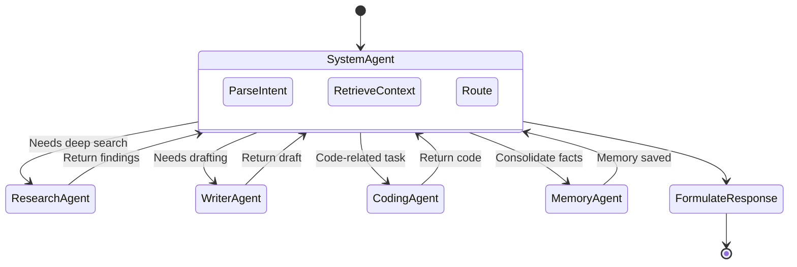
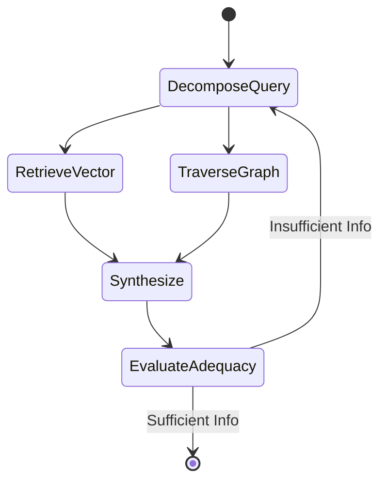
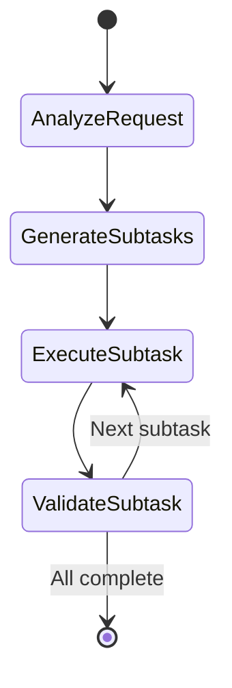

# Agent States & Workflows

Nodus uses **LangGraph** to model agents as deterministic, durable state machines. This ensures multi-step reasoning is robust, observable, and supports human-in-the-loop interventions.

## State Schema

The core state passed between agents is defined as follows:

```python
from typing import TypedDict, Annotated, Sequence
from langchain_core.messages import BaseMessage
import operator

class NodusState(TypedDict):
    messages: Annotated[Sequence[BaseMessage], operator.add]
    current_agent: str
    active_memory_context: dict
    entities_extracted: list[dict]
    task_plan: list[str]
    errors: list[str]
```

## System Orchestrator Workflow

The `SystemAgent` acts as the router and orchestrator.



## Research Agent Flow

The Research Agent executes a guarded reasoning loop to explore local and external data.



## Planner Agent Flow

Used for complex workflows spanning multiple sessions.


