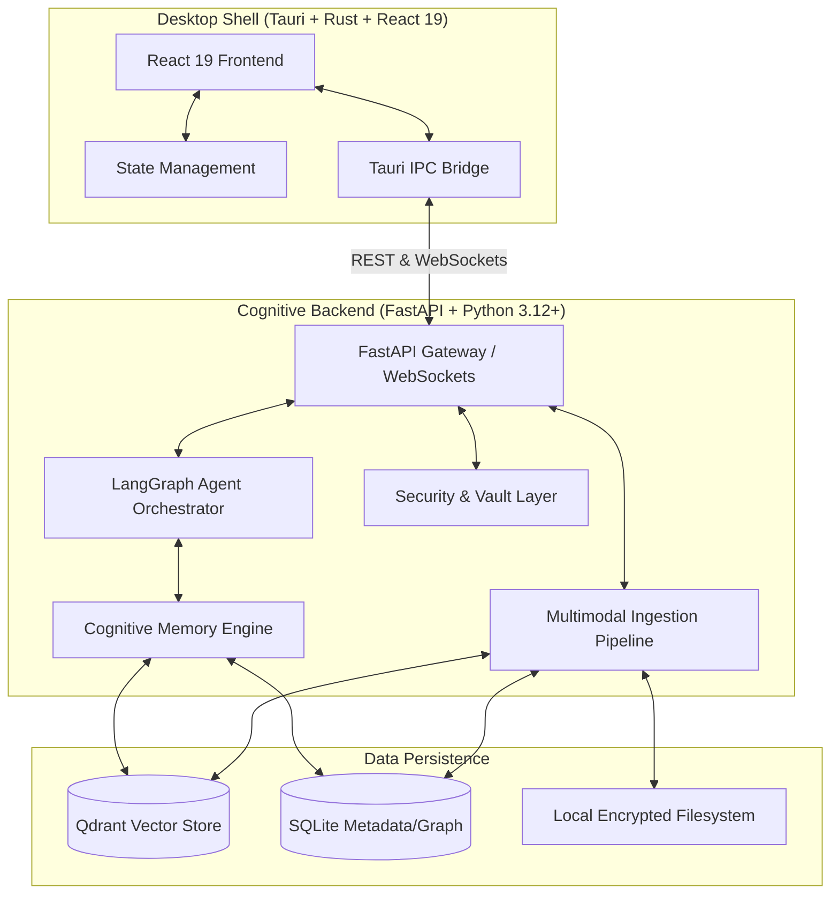
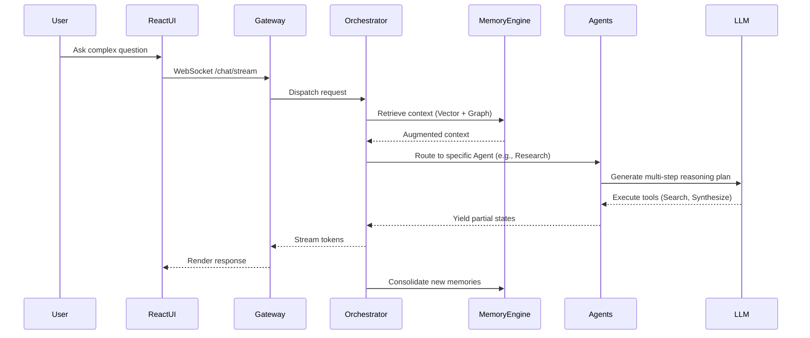
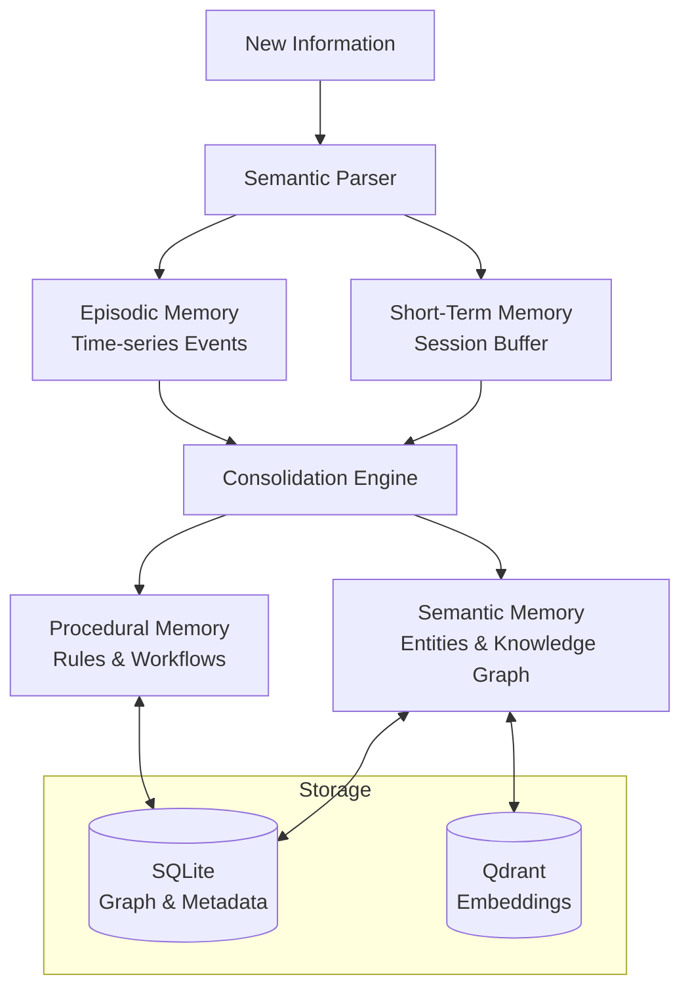

# System Architecture

Nodus vNext is designed as a **Local-First Cognitive AI Operating System**, operating via a native Tauri desktop app communicating with a modular Python backend over local IPC and WebSockets. The system prioritizes local execution, multimodal memory, and multi-agent reasoning.

## High-Level Topology

## Core Components

### 1. Desktop Shell (Tauri v2)
The frontend is written in React 19 and Tailwind v4. It manages the presentation layer, command palette, and local file picking. Rust handles OS-level features (tray, native notifications, file system access).

### 2. Cognitive Backend (Python Monolith)
Built with FastAPI and organized into distinct domains:
- **Gateway**: Exposes REST and WebSocket endpoints.
- **Orchestrator**: LangGraph-based state machine routing user intent to specialized agents.
- **Memory Engine**: Manages Short-Term (session context), Episodic (historical events), Semantic (facts & entities), and Procedural (workflows) memory.
- **Retrieval**: Fuses vector (Qdrant), graph traversal (SQLite), and keyword search.
- **Ingestion**: Asynchronous task queue processing documents, images, and audio into the memory stores.
- **Security**: Local vault for credentials and encryption keys.

## Data Flow: Reasoning Loop

## Memory Architecture

The memory engine uses a layered approach inspired by human cognition.

