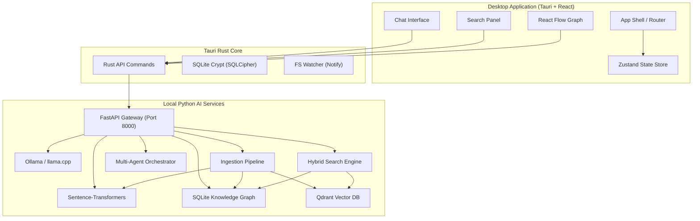
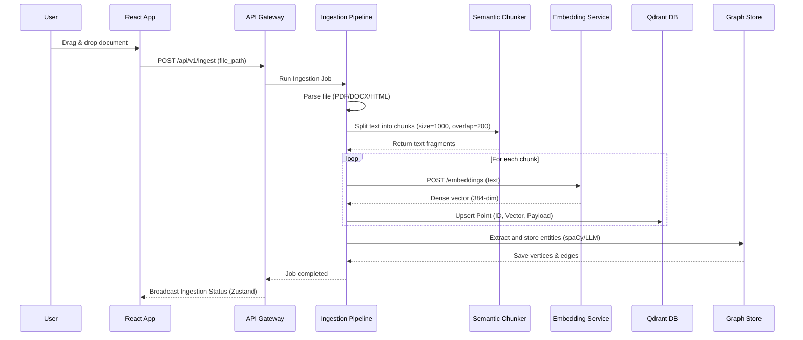
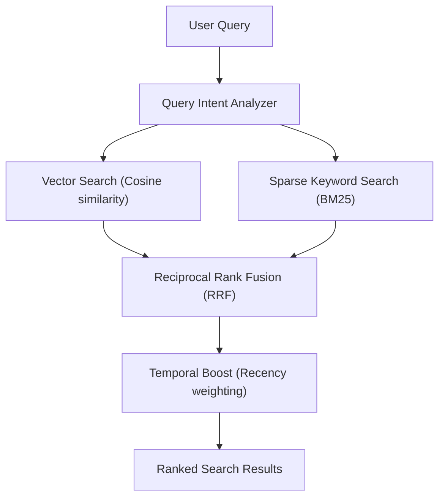
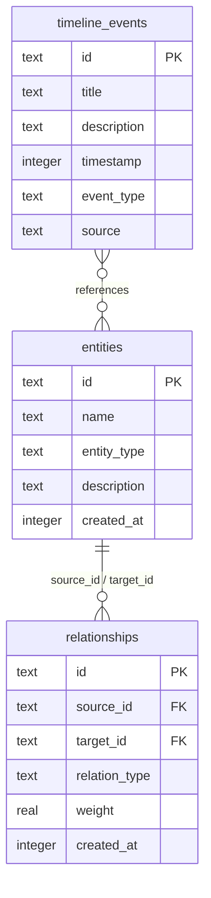

# Nodus System Architecture

This document describes the high-level architecture, design patterns, data flows, and database schemas of the Nodus local-first AI memory platform.

---

## 1. High-Level Architecture Overview

Nodus is structured as an offline-first desktop application with a decoupled, polyglot backend microservice layer. The local architecture ensures user data never leaves the host machine unless E2E encrypted synchronization is explicitly enabled.

### Technology Rationale
*   **Tauri v2 + React 19:** Combines the security and memory safety of Rust with a fast, modern HTML/JS rendering interface. Tauri uses the system webview to reduce the memory footprint relative to Electron.
*   **FastAPI:** High performance, asynchronous Python web framework used for rapid model execution and integration with AI frameworks (ONNX, Sentence-Transformers, LangGraph).
*   **Qdrant Embedded:** Lightweight, high-speed vector index running entirely in-process to avoid the management overhead of an external daemon.
*   **SQLite (SQLCipher):** Secure, relational database that manages the personal knowledge graph, text metadata, and audit logs.

---

## 2. Ingestion & Embedding Pipeline

The event-driven ingestion pipeline processes files from the local filesystem, extracts raw text, generates semantic vectors, and creates nodes in the knowledge graph.

---

## 3. Hybrid Search Retrieval

Nodus implements reciprocal rank fusion (RRF) to combine dense vector search with sparse keyword indexing.

*   **RRF Fusion Formula:**
    $$RRF\_Score(d) = \sum_{m \in M} \frac{1}{k + r_m(d)}$$
    Where $r_m(d)$ is the rank of document $d$ in retrieval method $m$, and $k$ is a constant (typically 60) to prevent outlier results from dominating.

---

## 4. Database Architecture & Schema

### SQLite Knowledge Graph Schema
The structural knowledge graph and timeline metrics are persisted in local SQLite. Key tables are structured as follows:

---

## 5. Security & Key Management

Nodus uses a zero-knowledge local execution profile:
1.  **Encryption at Rest:** All SQLite instances are initialized with **SQLCipher** using AES-256-CBC encryption.
2.  **OS Keychain Integration:** Database keys and sync credentials are encrypted and stored in the native OS credential store (Windows Credential Manager / macOS Keychain / Linux Secret Service) using Tauri's secure storage bindings.
3.  **Local Inference Sandboxing:** The local LLM and embedding runtimes execute entirely in localhost loops. Network ports are bound to `127.0.0.1` by default to prevent external access.
