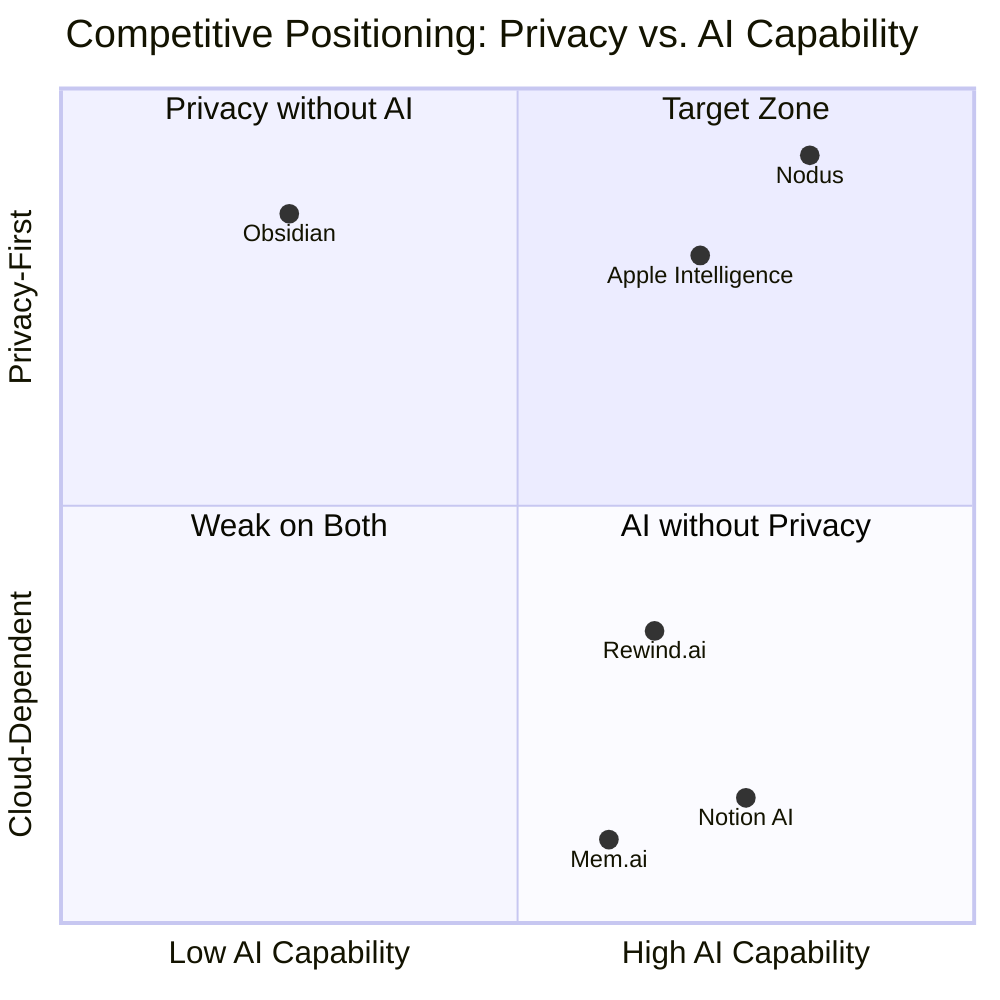
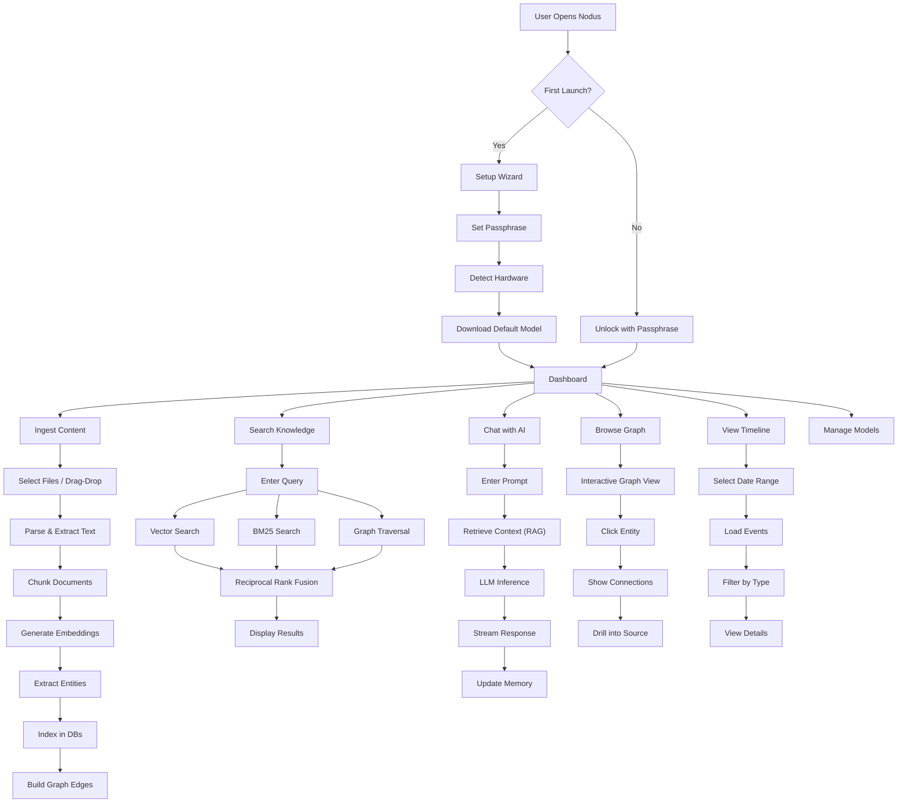
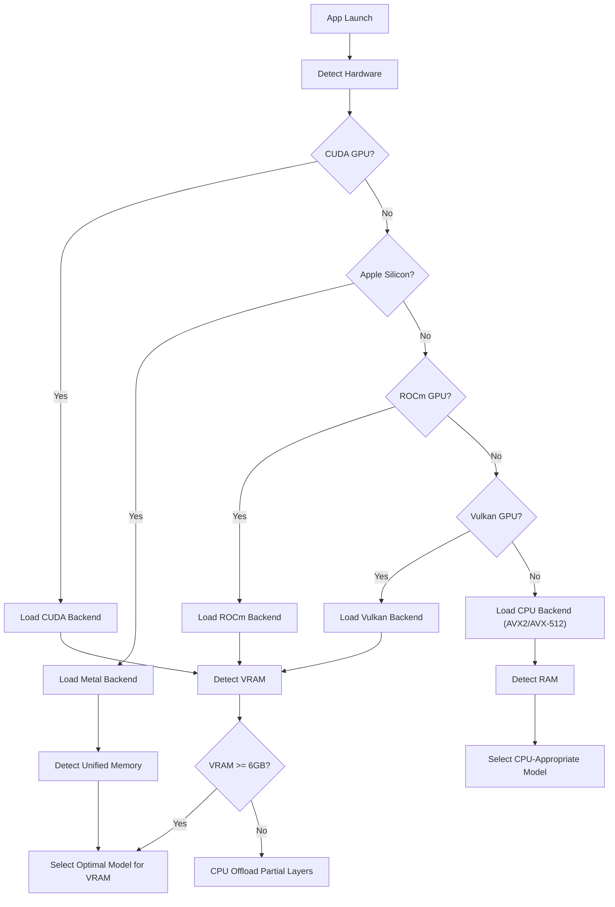
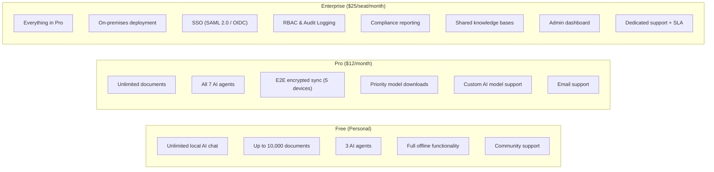
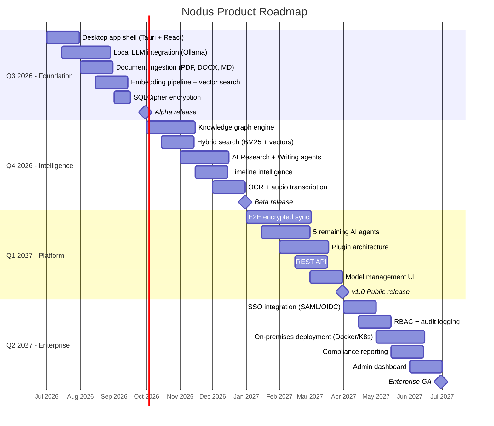
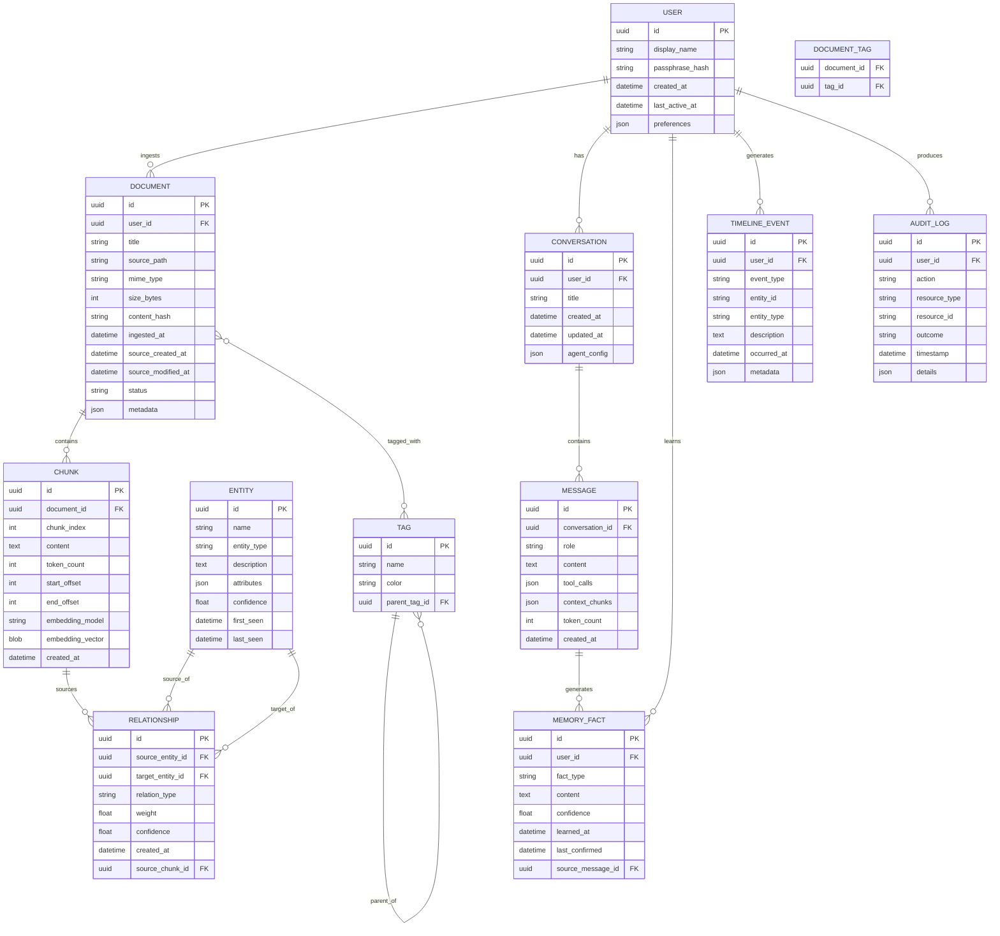
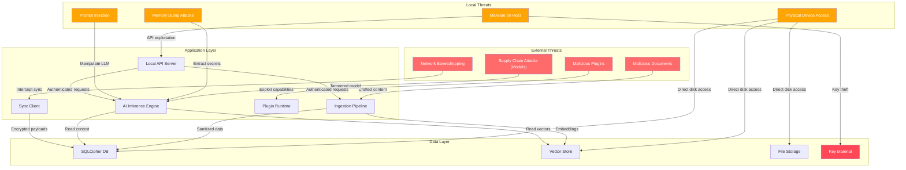

# Nodus — Product Requirements Document

**Version:** 1.0.0
**Last Updated:** 2026-05-26
**Status:** Approved
**Author:** Nodus Architecture Team

---

## Table of Contents

- [1. Vision & Mission](#1-vision--mission)
- [2. User Personas](#2-user-personas)
- [3. Market Analysis](#3-market-analysis)
- [4. Competitive Analysis](#4-competitive-analysis)
- [5. Privacy Requirements](#5-privacy-requirements)
- [6. Security Requirements](#6-security-requirements)
- [7. Functional Requirements](#7-functional-requirements)
- [8. Non-Functional Requirements](#8-non-functional-requirements)
- [9. Edge AI Constraints](#9-edge-ai-constraints)
- [10. Offline-First Requirements](#10-offline-first-requirements)
- [11. Monetization Strategy](#11-monetization-strategy)
- [12. Enterprise Opportunities](#12-enterprise-opportunities)
- [13. Risk Analysis](#13-risk-analysis)
- [14. Product Roadmap](#14-product-roadmap)
- [15. KPIs & Success Metrics](#15-kpis--success-metrics)
- [16. Core Data Model](#16-core-data-model)
- [17. Threat Model Overview](#17-threat-model-overview)

---

## 1. Vision & Mission

### Vision

**Empower individuals and organizations to own their AI-enhanced knowledge.**

The intelligence revolution should not require surrendering personal data to cloud providers. Nodus envisions a future where every knowledge worker has a personal AI that understands their entire body of work — running on their own hardware, under their own control, with zero data leakage.

### Mission

**Build the most private, powerful local-first AI knowledge platform.**

We will achieve this by:

1. **Running AI inference locally** — LLMs, embeddings, and agents execute on-device with GPU acceleration when available, CPU fallback always.
2. **Treating privacy as architecture, not policy** — Data never leaves the device unless the user explicitly opts into end-to-end encrypted sync.
3. **Building a knowledge graph, not just a search index** — Entities, relationships, and temporal context form a living, queryable memory graph.
4. **Making offline the default, not the exception** — Every feature works fully without network connectivity.
5. **Delivering enterprise-grade quality in a local-first package** — Audit logging, encryption at rest, role-based access, and compliance-ready architecture.

### Product Principles

| Principle | Description |
|---|---|
| **Privacy by Default** | No data collection. No telemetry. No cloud dependency. |
| **Local-First** | All computation happens on-device. Cloud is opt-in escalation. |
| **Intelligence Everywhere** | AI enhances every interaction — search, writing, organization, recall. |
| **Open & Extensible** | Plugin architecture, open formats, community-driven agents. |
| **Cross-Platform** | Windows, macOS, Linux with feature parity. |

---

## 2. User Personas

### Persona 1: Dr. Sarah Chen — Academic Researcher

| Attribute | Detail |
|---|---|
| **Role** | Postdoctoral researcher in computational biology |
| **Age** | 32 |
| **Tech Comfort** | High — uses CLI, Python, Jupyter notebooks daily |
| **Primary Goal** | Manage 10,000+ papers, extract connections, generate literature reviews |
| **Pain Points** | Papers scattered across Zotero, Google Drive, email; can't search inside PDFs semantically; privacy concerns with cloud AI tools for unpublished research |
| **Key Features** | Multimodal ingestion (PDF, DOCX), semantic search, knowledge graph, citation extraction, AI-assisted writing |
| **Quote** | *"I need an AI that has read everything I've read — and can find connections I missed."* |

### Persona 2: Marcus Thompson — Full-Stack Developer

| Attribute | Detail |
|---|---|
| **Role** | Senior engineer at a 50-person startup |
| **Age** | 28 |
| **Tech Comfort** | Expert — contributes to open-source, runs homelab |
| **Primary Goal** | Build a personal knowledge base of code snippets, architecture decisions, debugging notes |
| **Pain Points** | Context-switching between Notion, Slack, GitHub; AI coding tools send proprietary code to the cloud; bookmark graveyards in browsers |
| **Key Features** | Code-aware ingestion, AI coding agent, fast hybrid search, API access, CLI integration |
| **Quote** | *"I want my own private Copilot that knows my codebase and my notes — running on my own machine."* |

### Persona 3: Lisa Nakamura — Knowledge Worker / Product Manager

| Attribute | Detail |
|---|---|
| **Role** | Senior Product Manager at a Fortune 500 company |
| **Age** | 38 |
| **Tech Comfort** | Moderate — comfortable with web apps, averse to CLI |
| **Primary Goal** | Synthesize meeting notes, PRDs, customer feedback, and market research into actionable insights |
| **Pain Points** | Information silos across Confluence, Google Docs, Slack; AI tools not approved by security team; needs to reference months-old decisions instantly |
| **Key Features** | Timeline intelligence, AI-assisted summarization, meeting note ingestion, search across file types, polished UI |
| **Quote** | *"I spend 2 hours a day just finding information I know exists somewhere. I need instant recall."* |

### Persona 4: Alex Rivera — Graduate Student

| Attribute | Detail |
|---|---|
| **Role** | PhD student in philosophy |
| **Age** | 25 |
| **Tech Comfort** | Low-to-moderate — uses Word, basic web tools |
| **Primary Goal** | Organize dissertation research, track evolving arguments, connect ideas across sources |
| **Pain Points** | Free tools lack AI; paid tools too expensive on student budget; concerned about thesis ideas leaking through cloud AI |
| **Key Features** | Free tier, concept mapping, AI writing assistance, citation management, simple UX |
| **Quote** | *"I can't afford Notion AI, and I don't trust it with my unpublished thesis anyway."* |

### Persona 5: Enterprise Team — Meridian Analytics (10-person data science team)

| Attribute | Detail |
|---|---|
| **Role** | Data science team at a healthcare analytics company |
| **Team Size** | 10 analysts, 2 team leads, 1 CISO |
| **Tech Comfort** | High across the team |
| **Primary Goal** | Shared knowledge base of models, datasets, regulatory documents, SOPs — with HIPAA-grade privacy |
| **Pain Points** | Cannot use any cloud AI due to HIPAA; current wiki is unsearchable; onboarding new analysts takes 3 months |
| **Key Features** | On-premises deployment, SSO (SAML/OIDC), audit logging, role-based access, shared knowledge graph, compliance reporting |
| **Quote** | *"We need AI knowledge management that our CISO will actually approve."* |

---

## 3. Market Analysis

### Market Landscape

The AI-enhanced knowledge management market is at an inflection point. Three converging trends create a window of opportunity:

1. **Local AI feasibility** — Models like Llama 3, Mistral, and Phi-3 run effectively on consumer hardware with 8GB+ RAM.
2. **Privacy backlash** — Enterprise and individual users increasingly reject cloud-only AI that processes sensitive data on third-party infrastructure.
3. **Knowledge overload** — The average knowledge worker handles 11,000+ documents and spends 9.3 hours per week searching for information (McKinsey, 2025).

### Total Addressable Market (TAM)

| Segment | Users | ARPU | Market Size |
|---|---|---|---|
| Knowledge Workers (Global) | 1.25B | $12/mo | $180B |
| Researchers & Academics | 8M | $15/mo | $1.4B |
| Developers (Personal Knowledge) | 28M | $10/mo | $3.4B |
| Enterprise Teams (On-Prem AI) | 500K teams | $50/seat/mo | $6B |
| **Serviceable Addressable Market** | | | **$8B** |

### Competitor Landscape

| Product | Approach | AI | Privacy | Offline | Local AI |
|---|---|---|---|---|---|
| **Notion AI** | Cloud-first workspace | GPT-4 via API | ❌ All data in cloud | ❌ Partial | ❌ |
| **Obsidian** | Local markdown vault | ❌ (plugins only) | ✅ Local files | ✅ | ❌ (community plugins) |
| **Mem.ai** | Cloud AI notebook | GPT-4 via API | ❌ All data in cloud | ❌ | ❌ |
| **Rewind.ai** | Screen recording + AI | Cloud LLM | ⚠️ Local capture, cloud processing | ⚠️ Capture only | ❌ |
| **Apple Intelligence** | OS-level AI | On-device + Private Cloud | ✅ On-device first | ✅ | ✅ (Apple Silicon only) |
| **Nodus** | Local-first AI knowledge OS | On-device LLMs | ✅ Zero-knowledge | ✅ Full | ✅ (Any GPU/CPU) |

---

## 4. Competitive Analysis

### Feature Comparison Matrix

| Feature | Nodus | Notion AI | Obsidian | Mem.ai | Rewind.ai | Apple Intelligence |
|---|---|---|---|---|---|---|
| Local-first architecture | ✅ | ❌ | ✅ | ❌ | ⚠️ | ✅ |
| On-device LLM inference | ✅ | ❌ | ❌ | ❌ | ❌ | ✅ |
| Knowledge graph | ✅ | ❌ | ⚠️ Plugin | ✅ | ❌ | ❌ |
| Semantic search | ✅ Hybrid | ✅ Cloud | ❌ | ✅ Cloud | ✅ Cloud | ✅ |
| Multimodal ingestion | ✅ | ⚠️ | ❌ | ⚠️ | ✅ | ✅ |
| AI agents | ✅ 7 agents | ✅ 1 agent | ❌ | ✅ 1 agent | ❌ | ✅ |
| Encryption at rest | ✅ SQLCipher | ❌ | ❌ | ❌ | ✅ | ✅ |
| E2E encrypted sync | ✅ | ❌ | ✅ (paid) | ❌ | ❌ | ✅ |
| Offline functionality | ✅ Full | ❌ | ✅ | ❌ | ⚠️ | ✅ |
| Timeline intelligence | ✅ | ❌ | ❌ | ✅ | ✅ | ❌ |
| Cross-platform | ✅ Win/Mac/Linux | ✅ Web | ✅ Win/Mac/Linux | ✅ Web | ❌ Mac only | ❌ Apple only |
| Enterprise SSO/RBAC | ✅ | ✅ | ❌ | ❌ | ❌ | ✅ |
| Open source | ✅ MIT | ❌ | ❌ | ❌ | ❌ | ❌ |
| API access | ✅ REST | ✅ | ❌ | ✅ | ❌ | ❌ |
| Free tier | ✅ | ❌ | ✅ | ❌ | ❌ | ✅ |

### Competitive Positioning



### Key Differentiators

1. **Only product offering local AI + knowledge graph + enterprise features** — Apple Intelligence is close but locked to Apple hardware.
2. **Cross-platform local AI** — No competitor offers local LLM inference on Windows + Mac + Linux.
3. **Open-source with enterprise tier** — Obsidian is free but not open-source. Notion is neither.
4. **Hybrid search architecture** — Dense vectors + BM25 + metadata + graph traversal. No competitor combines all four.

---

## 5. Privacy Requirements

### Core Privacy Principles

| ID | Principle | Implementation |
|---|---|---|
| **PV-001** | No telemetry | Zero analytics, crash reports, or usage tracking unless explicitly opted in by the user. |
| **PV-002** | Local-first processing | All AI inference (LLM, embedding, OCR, transcription) runs on-device by default. |
| **PV-003** | User data ownership | All data stored in standard open formats. Full export at any time. No vendor lock-in. |
| **PV-004** | Zero-knowledge sync | If cloud sync is enabled, the server never sees plaintext. E2E encryption with client-held keys. |
| **PV-005** | No third-party data sharing | No data is ever shared with third parties. No advertising. No data brokerage. |
| **PV-006** | Transparent processing | Users can inspect exactly what data is being processed and by which AI model. |
| **PV-007** | Right to deletion | Complete data deletion including all vector embeddings, graph nodes, and cached inferences. |
| **PV-008** | Minimal permissions | The application requests only the file system permissions necessary for explicitly user-initiated operations. |

### Data Residency

```
┌─────────────────────────────────────────────┐
│               User's Device                  │
│  ┌─────────┐ ┌─────────┐ ┌───────────────┐ │
│  │ SQLite  │ │ Qdrant  │ │ LanceDB       │ │
│  │(SQLCipher)│ │(Vectors)│ │(Column Vectors)│ │
│  └─────────┘ └─────────┘ └───────────────┘ │
│  ┌─────────┐ ┌──────────────────────────┐   │
│  │ DuckDB  │ │ File Storage (originals) │   │
│  │(Analytics)│ │ + processed artifacts    │   │
│  └─────────┘ └──────────────────────────┘   │
│                                              │
│  All data stays here unless user opts into   │
│  end-to-end encrypted cloud sync.            │
└─────────────────────────────────────────────┘
```

---

## 6. Security Requirements

| ID | Requirement | Priority | Implementation |
|---|---|---|---|
| **SEC-001** | Encryption at rest | P0 | SQLCipher AES-256-CBC for all SQLite databases. Qdrant collections encrypted via OS-level full-disk encryption guidance. |
| **SEC-002** | Encryption in transit | P0 | TLS 1.3 for all HTTP communication between frontend and backend services. mTLS for inter-service communication. |
| **SEC-003** | Key management | P0 | Master encryption key derived from user passphrase via Argon2id. Key stored in OS keychain (macOS Keychain, Windows Credential Manager, Linux Secret Service). |
| **SEC-004** | Sandboxed AI execution | P0 | AI agent tool execution sandboxed — no network access, restricted file system scope, execution timeouts. |
| **SEC-005** | Prompt injection protection | P0 | Input sanitization on all user prompts. Output filtering to prevent data exfiltration via crafted responses. |
| **SEC-006** | Audit logging | P1 | All data access events logged with timestamp, actor, action, resource, and outcome. Logs stored in append-only encrypted SQLite table. |
| **SEC-007** | Authentication | P1 | Local: passphrase unlock. Enterprise: SAML 2.0 / OIDC SSO integration. |
| **SEC-008** | RBAC | P1 | Enterprise tier: role-based access control for shared knowledge bases. Roles: Admin, Editor, Viewer. |
| **SEC-009** | Secure update channel | P1 | Application updates signed with Ed25519 keys. Tauri updater verifies signatures before applying updates. |
| **SEC-010** | Memory protection | P2 | Sensitive data (keys, tokens) kept in non-swappable memory pages where OS supports it. Zeroed on deallocation. |

> For full security architecture, threat model, and encryption details, see [SECURITY.md](SECURITY.md).

---

## 7. Functional Requirements

### Core Features

| ID | Requirement | Priority | Description |
|---|---|---|---|
| **FR-001** | Local LLM Chat | P0 | Users can chat with a locally-running LLM (Llama 3, Mistral, Phi-3) with streaming responses. The system auto-detects available GPU (CUDA, Metal, ROCm, Vulkan) and falls back to CPU. |
| **FR-002** | Hybrid Semantic Search | P0 | Search across all ingested content using dense vector similarity (embedding-based), BM25 keyword matching, metadata filtering, and knowledge graph traversal. Results ranked by a learned fusion score. |
| **FR-003** | Document Ingestion | P0 | Ingest PDF, DOCX, PPTX, XLSX, Markdown, HTML, EPUB, plain text, images (with OCR), audio (with transcription), and video (with transcription + frame extraction). |
| **FR-004** | Knowledge Graph | P0 | Automatically extract entities (people, places, concepts, organizations, dates) and relationships from ingested content. Expose as a navigable, queryable graph with temporal edges. |
| **FR-005** | Persistent AI Memory | P0 | The AI retains conversational context across sessions. Memory stored as structured facts, user preferences, and interaction summaries in the knowledge graph. |
| **FR-006** | Encryption at Rest | P0 | All databases encrypted with AES-256-CBC via SQLCipher. Encryption key derived from user passphrase. |
| **FR-007** | Cross-Platform Desktop App | P0 | Native desktop application for Windows (10+), macOS (12+), and Linux (Ubuntu 22.04+, Fedora 38+, Arch) with platform-native look and feel. |

### Intelligence Features

| ID | Requirement | Priority | Description |
|---|---|---|---|
| **FR-008** | AI Research Agent | P1 | Agent that can search the knowledge base, synthesize information from multiple sources, generate structured research reports with citations. |
| **FR-009** | AI Writing Agent | P1 | Agent that assists with drafting, editing, expanding, and summarizing text. Adapts to user's writing style over time. |
| **FR-010** | AI Coding Agent | P1 | Agent that understands code context, explains code, generates code snippets, and helps debug — all using the local LLM. |
| **FR-011** | AI Organizer Agent | P1 | Agent that suggests tags, folders, and connections for newly ingested content based on existing knowledge structure. |
| **FR-012** | AI Recall Agent | P1 | Agent that can answer questions like "What did I read about X last month?" by combining temporal awareness with semantic search. |
| **FR-013** | AI Analyst Agent | P1 | Agent that performs quantitative analysis on structured data within the knowledge base — counts, trends, comparisons. |
| **FR-014** | AI Tutor Agent | P2 | Agent that creates study plans, quizzes, and explanations based on ingested course materials. |

### Platform Features

| ID | Requirement | Priority | Description |
|---|---|---|---|
| **FR-015** | Timeline Intelligence | P1 | Navigate knowledge chronologically. View what was ingested, created, or modified on any given day/week/month. Filter by source type and topic. |
| **FR-016** | Model Management | P1 | Download, install, switch, and delete local AI models. Show model size, quantization level, performance benchmarks, and VRAM requirements. |
| **FR-017** | E2E Encrypted Sync | P2 | Optional end-to-end encrypted sync between devices. Differential sync to minimize bandwidth. Conflict resolution with CRDT-based merge. |
| **FR-018** | Plugin Architecture | P2 | Extensible plugin system for custom ingestion parsers, AI agents, and UI components. Plugins sandboxed with explicit capability declarations. |
| **FR-019** | REST API | P1 | Full REST API for programmatic access to chat, search, ingestion, graph, models, timeline, and agents. API key authentication. |
| **FR-020** | Export / Backup | P1 | Full data export in open formats (Markdown, JSON, SQLite, CSV). Automated scheduled backups to user-specified location. |
| **FR-021** | Tagging & Organization | P1 | Hierarchical tags, folders, and smart collections. AI-suggested organization. Bulk operations. |
| **FR-022** | File Previewer | P2 | In-app preview for PDF, images, Markdown, code files, and office documents. Annotation support for PDFs and images. |
| **FR-023** | Keyboard Shortcuts | P2 | Comprehensive keyboard shortcut system. Global hotkey for quick capture. Vim-style navigation optional. |
| **FR-024** | Multi-Language Support | P2 | UI localization for English, Spanish, French, German, Japanese, Chinese, Korean. Multilingual semantic search via multilingual embedding models. |

### User Flow Diagram



---

## 8. Non-Functional Requirements

| ID | Category | Requirement | Target |
|---|---|---|---|
| **NFR-001** | Performance | Chat response first-token latency | ≤ 500ms (GPU), ≤ 2s (CPU) |
| **NFR-002** | Performance | Search query response time | ≤ 200ms for 100K documents |
| **NFR-003** | Performance | Document ingestion throughput | ≥ 10 pages/sec for PDF |
| **NFR-004** | Performance | Application cold start time | ≤ 3s to interactive UI |
| **NFR-005** | Performance | Memory usage (idle) | ≤ 300MB RAM without model loaded |
| **NFR-006** | Scalability | Maximum knowledge base size | ≥ 1M documents, ≥ 10M chunks |
| **NFR-007** | Scalability | Concurrent AI operations | ≥ 3 (search + chat + ingestion) |
| **NFR-008** | Reliability | Application crash rate | ≤ 0.1% of sessions |
| **NFR-009** | Reliability | Data integrity | Zero data loss on crash (WAL mode for SQLite) |
| **NFR-010** | Reliability | Graceful degradation | If GPU unavailable, fall back to CPU automatically |
| **NFR-011** | Usability | Time to first value | ≤ 5 minutes from download to first AI chat |
| **NFR-012** | Usability | Accessibility | WCAG 2.1 AA compliance |
| **NFR-013** | Maintainability | Test coverage | ≥ 80% for core services |
| **NFR-014** | Maintainability | CI/CD pipeline | Automated build, test, and release for all platforms |
| **NFR-015** | Portability | Binary size | ≤ 150MB (excluding AI models) |

---

## 9. Edge AI Constraints

### Minimum Hardware Requirements

| Resource | Minimum | Recommended | Notes |
|---|---|---|---|
| **RAM** | 8 GB | 16 GB | 8GB enables 7B Q4 models; 16GB enables 13B Q4 |
| **CPU** | 4 cores, AVX2 | 8 cores, AVX-512 | AVX2 required for llama.cpp SIMD |
| **GPU** | None (CPU fallback) | 6GB+ VRAM | CUDA 12+, Metal, ROCm, Vulkan |
| **Storage** | 2 GB + models | 10 GB + models | ~4GB for a 7B Q4 model |
| **OS** | Win 10 / macOS 12 / Ubuntu 22.04 | Latest versions | |

### Model Strategy

```
┌────────────────────────────────────────────────────────┐
│                   Model Tier System                     │
├──────────┬─────────┬────────┬──────────┬───────────────┤
│ Tier     │ Size    │ Quant  │ RAM Need │ Use Case      │
├──────────┼─────────┼────────┼──────────┼───────────────┤
│ Nano     │ 1-3B    │ Q4_K_M │ 4 GB    │ Autocomplete  │
│ Small    │ 7B      │ Q4_K_M │ 6 GB    │ Chat, Search  │
│ Medium   │ 13B     │ Q4_K_M │ 10 GB   │ Agents, Writing│
│ Large    │ 30-70B  │ Q4_K_M │ 32 GB   │ Complex tasks │
│ Embed    │ 33M     │ FP16   │ 256 MB  │ Embeddings    │
└──────────┴─────────┴────────┴──────────┴───────────────┘
```

### GPU Detection & Fallback



### Quantization Strategy

- **Default format**: GGUF (llama.cpp native) for maximum compatibility
- **Recommended quantization**: Q4_K_M (best quality-to-size ratio at 4-bit)
- **Embedding models**: Run in FP16 via ONNX Runtime or sentence-transformers for accuracy
- **Whisper models**: FP16 via whisper.cpp for transcription quality
- **Fallback chain**: Q4_K_M → Q5_K_M → Q8_0 → FP16 (based on available resources)

---

## 10. Offline-First Requirements

### Design Principles

1. **Network is a luxury, not a dependency** — Every feature works fully offline.
2. **Sync is eventual, not blocking** — When network is available, sync happens in the background.
3. **Conflict resolution is automatic** — CRDT-based merge for concurrent edits.

### Offline Capability Matrix

| Feature | Offline Support | Notes |
|---|---|---|
| AI Chat | ✅ Full | Local LLM inference |
| Semantic Search | ✅ Full | Local embeddings + local vector DB |
| Document Ingestion | ✅ Full | Local parsers, OCR, transcription |
| Knowledge Graph | ✅ Full | Local graph storage and traversal |
| Timeline | ✅ Full | Local event store |
| AI Agents | ✅ Full | All tools operate locally |
| Model Download | ❌ Requires network | One-time download, then offline |
| Sync | ❌ Requires network | Queues operations for later sync |
| Plugin Marketplace | ❌ Requires network | Plugins cached locally after install |
| Cloud Escalation | ❌ Requires network | Optional feature; graceful fallback |

### Offline Data Architecture

- All databases (SQLite, Qdrant, DuckDB, LanceDB) are embedded, file-based, and require zero network
- AI models stored as local GGUF files
- Ingestion pipeline processes files entirely on-device
- Search operates against local indices only
- Sync queue persists pending operations in SQLite for later transmission

---

## 11. Monetization Strategy

### Tier Structure



### Revenue Projections (Year 1-3)

| Metric | Year 1 | Year 2 | Year 3 |
|---|---|---|---|
| Free Users | 50,000 | 250,000 | 1,000,000 |
| Pro Conversions (5%) | 2,500 | 12,500 | 50,000 |
| Enterprise Seats | 200 | 2,000 | 15,000 |
| Pro ARR | $360K | $1.8M | $7.2M |
| Enterprise ARR | $60K | $600K | $4.5M |
| **Total ARR** | **$420K** | **$2.4M** | **$11.7M** |

---

## 12. Enterprise Opportunities

### On-Premises Deployment

- **Docker Compose** — Single-command deployment for small teams (5-20 users)
- **Kubernetes (Helm)** — Scalable deployment for larger organizations (20-500 users)
- **Air-gapped deployment** — Full functionality without any internet access, including pre-bundled AI models
- **Hardware appliance** — Pre-configured NUC/server with Nodus pre-installed (partnership opportunity)

### Enterprise Features

| Feature | Description |
|---|---|
| **SSO Integration** | SAML 2.0, OIDC (Okta, Azure AD, Google Workspace, OneLogin) |
| **RBAC** | Admin, Editor, Viewer roles. Custom role definitions. Workspace-level and folder-level permissions. |
| **Audit Logging** | Immutable, append-only audit trail. Every read, write, delete, and AI interaction logged. Export in SIEM-compatible formats (CEF, JSON). |
| **Compliance Reporting** | Pre-built reports for HIPAA, SOC 2, GDPR, CCPA. Data residency proof. Encryption verification. |
| **Shared Knowledge Bases** | Team-scoped knowledge bases with configurable access. Cross-team knowledge sharing with approval workflows. |
| **Admin Dashboard** | User management, storage quotas, model allocation, usage analytics (local analytics only — no telemetry). |
| **Centralized Model Management** | Admin-controlled model allowlist. Pre-deploy models to user devices. GPU resource allocation policies. |
| **Data Loss Prevention** | Configurable DLP policies. Prevent export of classified documents. Watermarking for screenshots. |

### Compliance Targets

- **HIPAA** — Healthcare data handling with BAA support
- **SOC 2 Type II** — Security and availability controls
- **GDPR** — EU data protection compliance
- **CCPA** — California consumer privacy compliance
- **FedRAMP** — US government deployment (roadmap)
- **ISO 27001** — Information security management (roadmap)

---

## 13. Risk Analysis

### Technical Risks

| Risk | Likelihood | Impact | Mitigation |
|---|---|---|---|
| Local LLM quality insufficient for complex tasks | Medium | High | Tiered model strategy; optional cloud escalation with E2E encryption; invest in fine-tuning for domain-specific tasks |
| Cross-platform GPU compatibility issues | High | Medium | Abstract GPU layer via Ollama/llama.cpp; extensive CI testing on CUDA, Metal, ROCm; CPU fallback guaranteed |
| Large knowledge base performance degradation | Medium | High | Tiered indexing (hot/warm/cold); aggressive caching; DuckDB for analytics offload; LanceDB for efficient vector scans |
| Embedded database corruption on crash | Low | Critical | SQLite WAL mode; periodic integrity checks; automatic backup before major operations; Qdrant snapshot/restore |
| Tauri v2 stability on Linux | Medium | Medium | Extensive distro testing; fallback to Electron as last resort; AppImage distribution for broad compatibility |

### Market Risks

| Risk | Likelihood | Impact | Mitigation |
|---|---|---|---|
| Apple Intelligence captures privacy-conscious market | High | High | Differentiate on cross-platform, open-source, and enterprise features that Apple cannot offer |
| Notion/Obsidian add local AI capabilities | Medium | High | Maintain 18-month feature lead in knowledge graph + multi-agent architecture; build community moat |
| Open-source competitors emerge | Medium | Medium | Focus on polish, enterprise features, and community. Being open-source ourselves removes this as a disadvantage |
| Privacy regulations change AI model requirements | Low | Medium | Modular model architecture allows swapping models; on-device processing already exceeds most regulatory requirements |

### Security Risks

| Risk | Likelihood | Impact | Mitigation |
|---|---|---|---|
| Prompt injection attacks via ingested documents | Medium | High | Input sanitization pipeline; content segmentation; privileged prompt isolation; output filtering |
| Key material exposure in memory dumps | Low | Critical | OS keychain storage; non-swappable memory pages; key zeroing on deallocation; Rust memory safety |
| Supply chain attack on AI models | Low | High | Model checksum verification; signed model manifests; model provenance tracking |
| Local API exploitation by malicious software | Medium | Medium | Localhost-only binding; API key authentication; request rate limiting; Tauri's built-in CSP |

---

## 14. Product Roadmap

### Q3 2026 — Foundation



### Milestone Definitions

| Milestone | Date | Criteria |
|---|---|---|
| **Alpha** | Q3 2026 | Core chat + ingestion + search working on all platforms. Internal testing. |
| **Beta** | Q4 2026 | Knowledge graph + agents + timeline. 500 beta testers. |
| **v1.0 GA** | Q1 2027 | Full feature set. Sync. API. Plugin system. Public launch. |
| **Enterprise GA** | Q2 2027 | SSO, RBAC, audit, compliance. First enterprise customers. |

---

## 15. KPIs & Success Metrics

### Product Metrics

| Metric | Target (Year 1) | Measurement Method |
|---|---|---|
| Monthly Active Users (MAU) | 25,000 | Local opt-in analytics (anonymized count only) |
| Daily Active Users (DAU) | 8,000 | Local opt-in analytics |
| Documents Ingested (avg/user) | 500 | Aggregate from opt-in analytics |
| AI Queries per Day (avg/user) | 15 | Local measurement |
| Knowledge Graph Nodes (avg/user) | 2,000 | Local measurement |
| Search P50 Latency | ≤ 150ms | Performance benchmarks |
| LLM First-Token P50 Latency | ≤ 400ms (GPU) | Performance benchmarks |

### Business Metrics

| Metric | Target (Year 1) | Notes |
|---|---|---|
| Total Downloads | 100,000 | All platforms combined |
| Free-to-Pro Conversion Rate | 5% | Industry avg: 2-5% for developer tools |
| Pro Monthly Churn | ≤ 3% | Target < industry avg of 5% |
| Enterprise Pipeline | 20 qualified leads | From beta program and content marketing |
| Net Promoter Score (NPS) | ≥ 50 | Quarterly survey of active users |
| GitHub Stars | 10,000 | Community engagement signal |
| Community Contributors | 50 | PRs merged from external contributors |

### Technical Health Metrics

| Metric | Target | Notes |
|---|---|---|
| Crash-Free Sessions | ≥ 99.9% | Monitored via local crash reporter |
| CI Build Success Rate | ≥ 95% | All platforms, all tests |
| Test Coverage (Core) | ≥ 80% | Unit + integration tests |
| P95 Search Latency | ≤ 500ms | For 100K document knowledge base |
| Ingestion Success Rate | ≥ 99% | Across all supported file types |

---

## 16. Core Data Model



---

## 17. Threat Model Overview



> For the complete STRIDE threat analysis and security architecture, see [SECURITY.md](SECURITY.md).

---

## Appendix A: Glossary

| Term | Definition |
|---|---|
| **BM25** | Best Matching 25 — a probabilistic keyword search algorithm |
| **CRDT** | Conflict-free Replicated Data Type — a data structure for distributed merge |
| **E2E** | End-to-End (encryption) |
| **GGUF** | GPT-Generated Unified Format — model file format for llama.cpp |
| **RAG** | Retrieval-Augmented Generation — enhancing LLM responses with retrieved context |
| **SQLCipher** | Encrypted SQLite extension using AES-256-CBC |
| **SSE** | Server-Sent Events — HTTP streaming protocol |
| **STRIDE** | Spoofing, Tampering, Repudiation, Information Disclosure, DoS, Elevation of Privilege |
| **WAL** | Write-Ahead Logging — SQLite journaling mode for crash safety |

## Appendix B: References

- [Tauri v2 Documentation](https://v2.tauri.app/)
- [llama.cpp](https://github.com/ggerganov/llama.cpp)
- [Ollama](https://ollama.ai/)
- [LangGraph](https://langchain-ai.github.io/langgraph/)
- [SQLCipher](https://www.zetetic.net/sqlcipher/)
- [Qdrant](https://qdrant.tech/)
- [DuckDB](https://duckdb.org/)
- [LanceDB](https://lancedb.github.io/lancedb/)
